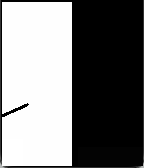
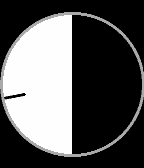
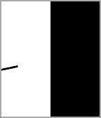
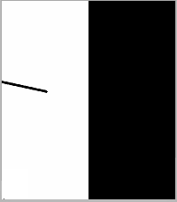

# Simple Eclipse

A minimal Pebble watchface that progressively fills the screen radially based on the hour. At 00:00 the screen is completely black, gradually becoming white until 12:00, then fading back to black until 24:00.

## Screenshots
### Pebble Classic/Steel/2/Duo

### Pebble Time/Time Steel

### Pebble Time Round

### Pebble Time 2

## Store
[Rebble App Store](https://apps.rebble.io/en_US/application/6978ff6c047265000996d297)
