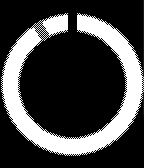
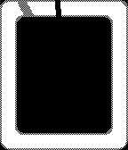
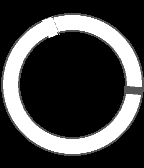
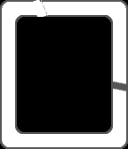
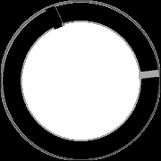
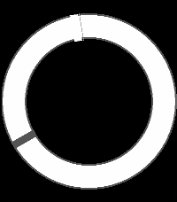
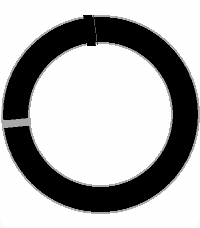

# Simple Eclipse

A minimal Pebble watchface that draws concentric rings and rotating hour/minute markers.

## Screenshots
### Pebble Classic/Steel/2/Duo

### Pebble Time/Time Steel

### Pebble Time Round

### Pebble Time 2

## Store
[Rebble App Store](https://apps.rebble.io/en_US/application/6974a40065b98f00098a7cf9)

## Features

- Concentric ring with outer/inner borders
- Minute and hour markers (hour marker has a thin border on the clockwise/right side)